# Kanban

## Principles and practices

---

### 🎮 Interaction time 🎮

#### What Kanban means to you?

Note:
Apuntar en una pissarra per al final repassar-ho

---

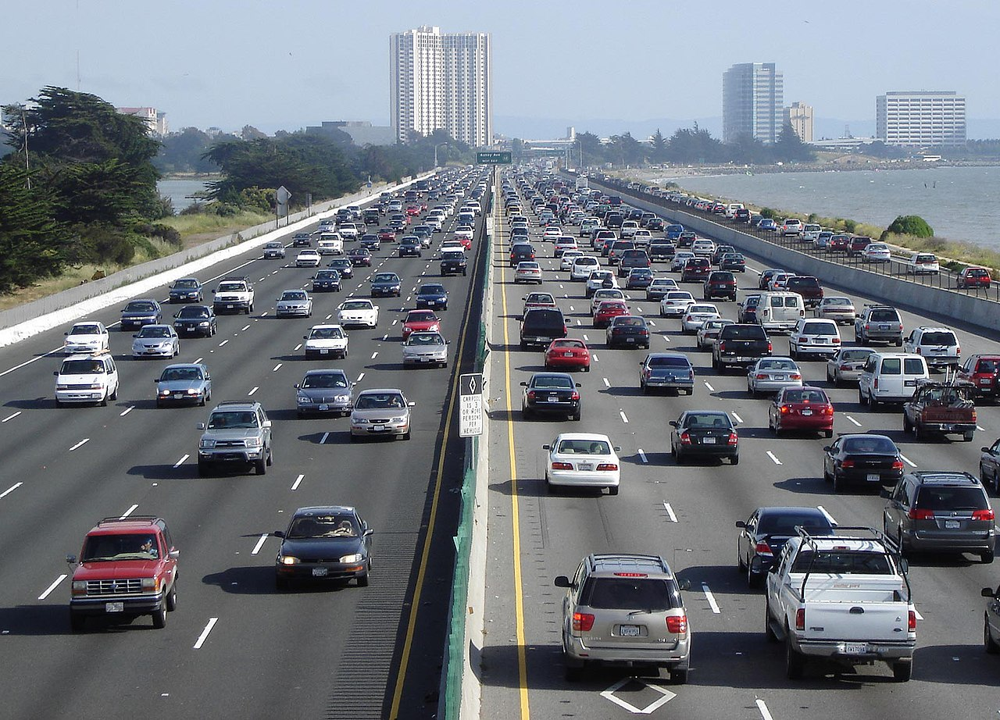

Note:
- Quant trigues en anar a la feina? Depèn. Del moment, del carril, de mil coses
- Posar més cotxes o més carrils no té perque millorar el transit
- Sistema complex, hem de treballar per acció reacció (no complicat, complex)
- Kanban ens ajuda a controlar el sistema i fer-lo predible, però cal que sigui estable

---

### A bit of history

Note:

- Visual board en japones
- Toyota al 1940, just in time, pull, no waste
- Lligat a Lean manufacturing, minimitzar perdues i maximitzar valor

---

### Kanban & Agile Methodologies

 <!-- .element: class="noborder" -->

Note:

- Ressignificació al s.XXI, agile communtiy
- Diferents autors (casi tot homes blancs), David J. Anderson
- Teorització sobre principis i pràctiques

---

### What's not _(only)_ Kanban?

- A board
- Scrum but more simple
- Scrum but with less meetings
- Scrum but without sprints

Note:
Algunes son part de Kanban, però amb només això no tindrem les millores d'eficiencia que s'aconsegueixen amb el mètode complet

---

## The Kanban Method

Note:
Comencem a parlar del Kanban que ens interessa

---

### Pull system

- Work is pulled when there is demand...
- ... and the system has capacity to absorb it
- This is opossed to time-based approach like Scrum

Note:
Optimize flow not resources, getting things done, start finishing stop starting, reduce waste, improve value

---

### Kanban principles

- Change Management principles
- Service Delivery  principles

Note:

- Com barrejar-se amb els processos actuals sense ser disruptius, buscant millora continua
- Orientarse a servir a les usuaries de forma autogestionada

---

#### Change Management principles

- Start With What You Do Now <!-- .element: class="fragment highlight-current-blue" -->
- Agree to Pursue Incremental, Evolutionary Change <!-- .element: class="fragment highlight-current-blue" -->
- Encourage Acts of Leadership at All Levels <!-- .element: class="fragment highlight-current-blue" -->

Note:

- Flexibilitat per constuir-se sobre processos actuals, reconeix rols i responsabilitats actuals, destacar problemes a resoldre i plantejar solucions de forma iterativa i no disruptiva
- Canvis petits amb feedback continuu, acceptar entre tottes que mai arribarem al final, kaizen, utopia
- No esperar a que els canvis només vinguin de lideratges actuals, espais segurs per risc i error

---

#### Service Delivery principles

- Focus on Customer’s Needs and Expectations <!-- .element: class="fragment highlight-current-blue" -->
- Manage the Work, Not the Workers <!-- .element: class="fragment highlight-current-blue" -->
- Regularly Review the Network of Services <!-- .element: class="fragment highlight-current-blue" -->

Note:

- Entregar valor a sòcies i ET nucli de l'organització, entendre i alinear necessitats i expectatives
- Eliminar el micromanagement, Equips autogestionats al voltant de les tasques, canviem com es fan les tasques no el que fa cadascu
- Revisar amb les usuaries com està funcionant tot, qualitat, tempos, normatives...

---

### Kanban practices

1. Visualize Workflow
2. Limit Work In Progress (WIP)
3. Manage flow
4. Make policies explicit
5. Implement Feedback Loops
6. Improve Collaboratively, Improve Experimentally

Note:
- 6 pràctiques core per una bona implementació
- Han d'estar pressents però és un procés evolutiu
- 40% organitzacions encara diuen estar madurant

---

#### 1. Visualize Workflow

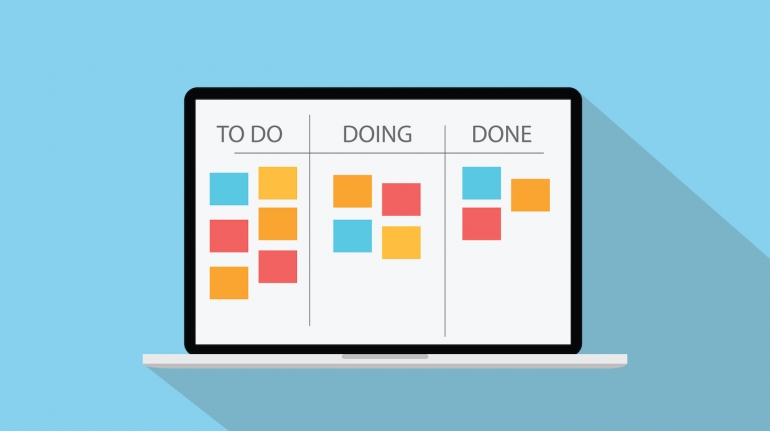

Note:
- El que ja coneixem, desde les 3 columnes més simples
- Representar tasques en curs
- També workflow i riscos (bloquejos, colls d'ampolla)

---

#### 2. Limit Work In Progress (WIP)

<iframe width="560" height="315" src="https://www.youtube.com/embed/CostXs2p6r0" title="YouTube video player" frameborder="0" allow="accelerometer; autoplay; clipboard-write; encrypted-media; gyroscope; picture-in-picture; web-share" allowfullscreen></iframe>

Note:
- Molt lligat a pull system i a optimitzar flow no recursos
- Sense WIP limits no hi ha Kanban
- Canvis de context fan molt mal, acumular fa que tot el sistema vagi més a poc a poc

---

#### 3. Manage flow

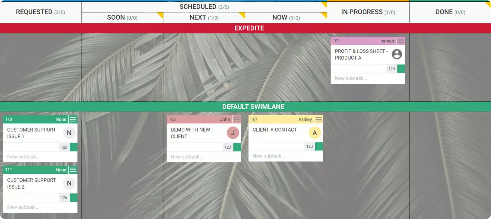

Note:
- Volem otimitzar lead time i cycle time a traves de manage flow
- Per canviar com es comporta el sistema canviem el flow no micromanagemnt
- Exemples bloquejos, swimlanes, més columnes, queue columns...
- Tasques petites, comenençar per la dreta, eliminar bloquejos ràpid...

---

#### 4. Make policies explicit

- All team is in the same page
- More rational discussions of issues, rules...
- Easier to change
- Easier onboarding

Note:
Per policies diem limits, quan es passa una columna, DoD, DoR, quan es bloqueja, on van les noves tasques... tot.

---

#### 5. Implement Feedback Loops

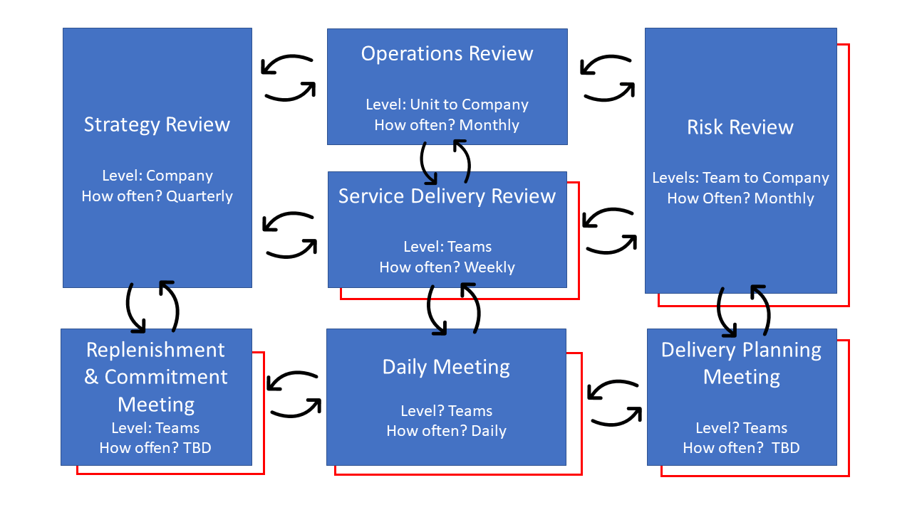

Note:
- Diferents punts que proposa kanban (alguns retro deconstruida)
- Feedback loops de equip i de servei
- Tenir en compte també feedback loops de producte (tasques, iniciatives...)

---

#### 6. Improve Collaboratively, Improve Experimentally

- Small changes agreed with the team
- Team is in the same page -> minimal friction
- Based on proven methods, feedback, metrics...

Note:
- L'equip està a la mateixa pàgina perquè te clar el workflow, policies, tasques, bloquejos... per tant afegir canvis petits hauria de mantenir el sistema estable i es fàcil que tothom estigui d'acord.
- Fem servir info que tenim per plantejar hipotesis i provar coses (mètode cientific)

---

## Kanban metrics and predictability

Note:
Les metriques ens serveixen tant per millorar el procés com per aconseguir predictibilitat

---

### Basic kanban metrics

 <!-- .element: style="width:75%;" -->

Note:
Cycle time dins el WIP, thoughput una altre forma de veure el mateix, lead time des de que es demana, response time desde que es demana fins que entra al sistema

---

### Cumulative Flow Diagram

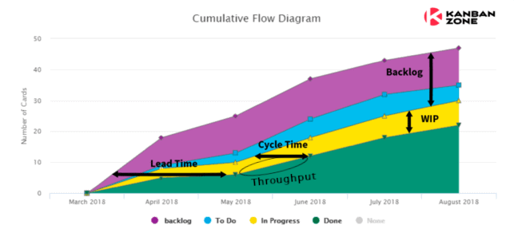

Note:
Ens ajuda a entendre com funciona el sistema d'una vista ràpida

---

### Throughput run chart

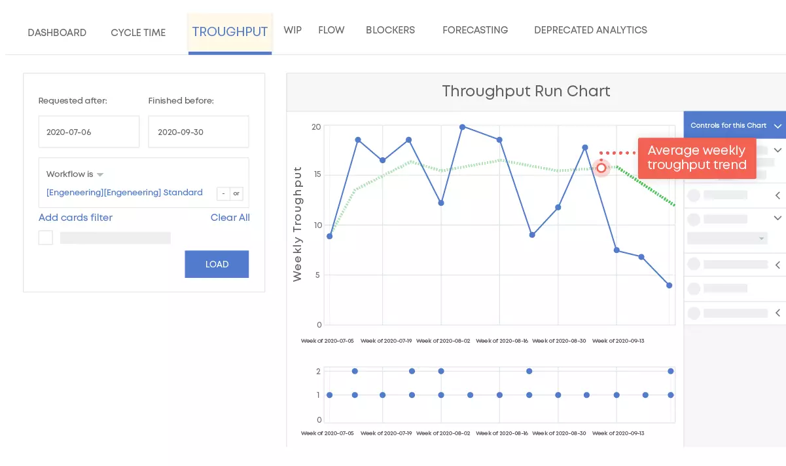

Note:
Quantes coses pot entregar l'equip per dia, setmana...

---

### Cycle time scatterplot

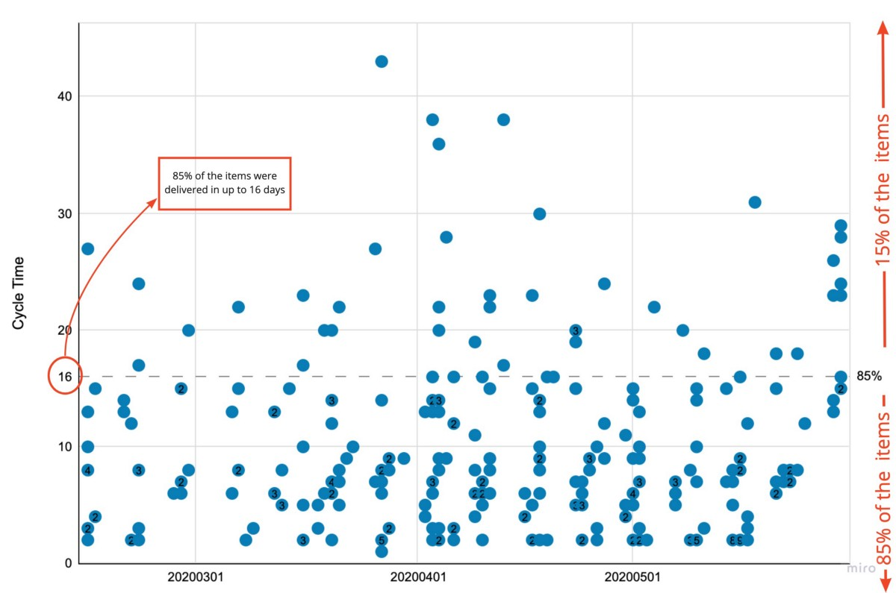 <!-- .element: style="width:75%;" -->

Note:
Introduir la forma en la que kanban fa servir la probabilitat

---

### Wip run chart

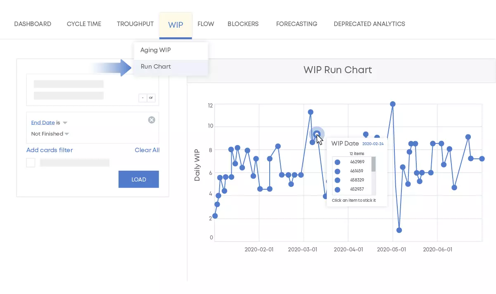

Note:
Quant WIP acumula l'equip, ens pot servir per veure com afecta a altres mètriques

---

### Blocker clustering

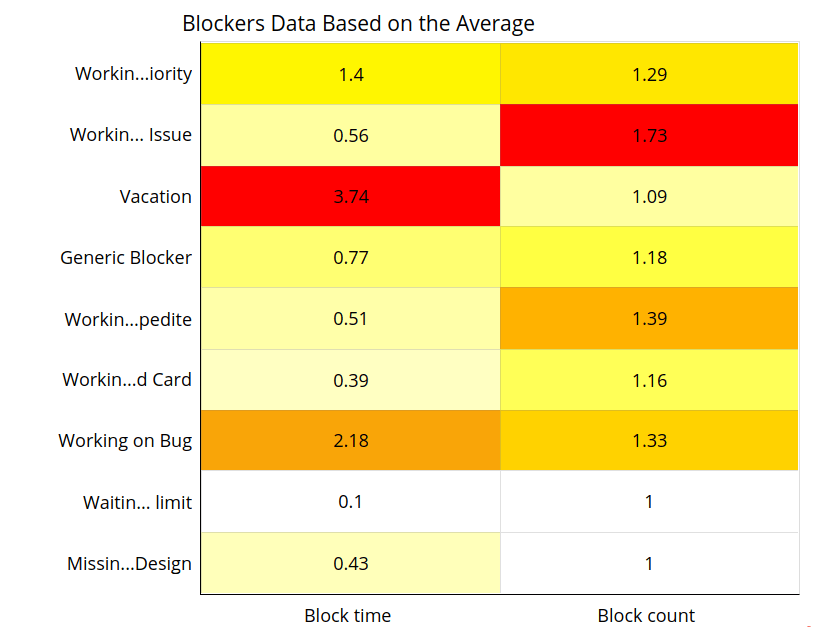 <!-- .element: style="width:75%;" -->

Note:
Necessites bon flow managing (3). Entendre quins bloquejos té l'equip per prioritzar que resoldre

---

### Monte Carlo: How many

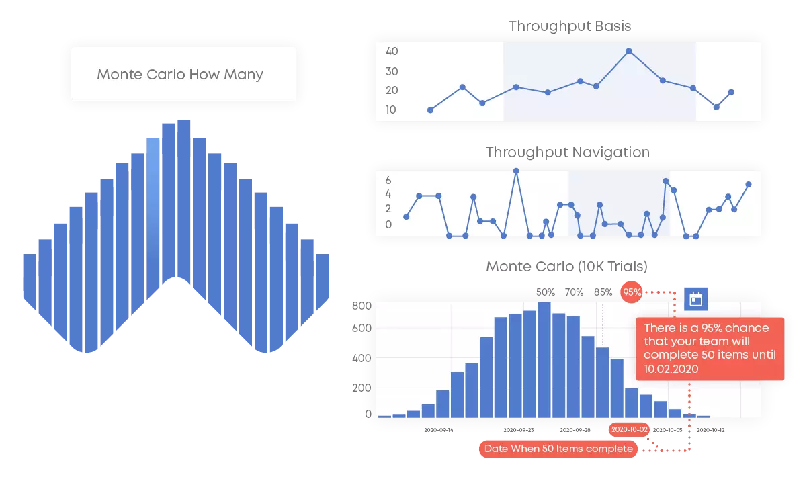

Note:
Amb X probabilitat quantes tasques haurà fet l'equip X dia.

---

### Monte Carlo: When

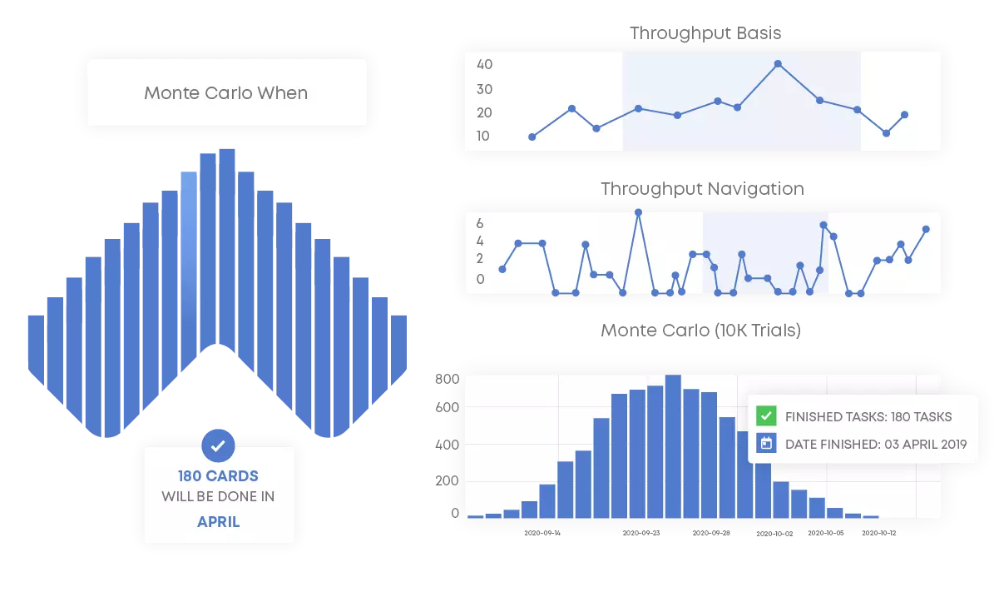

Note:
Amb X probabilitat quin dia entregarà l'equip X tasques.

---
### 🎮 Interaction time 🎮

#### What new thing you learned about Kanban?

##### Would you change your initial definition now? 🤔

---

## Questions ❓

---

## Thank you 😊
